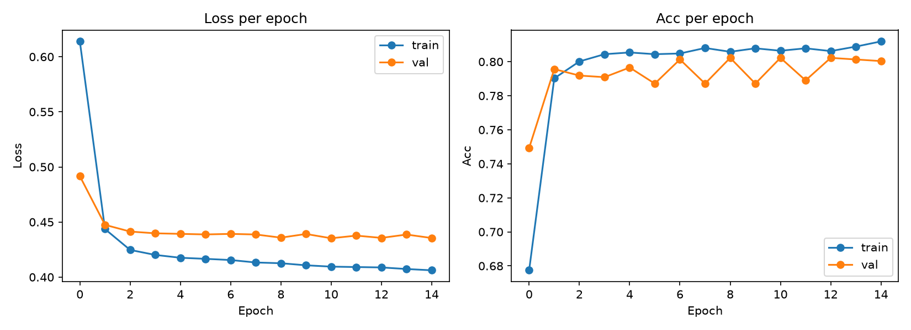
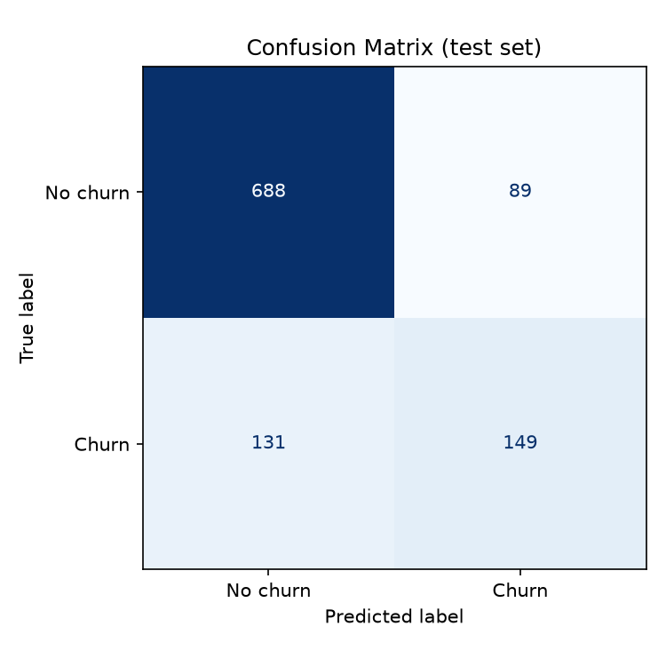
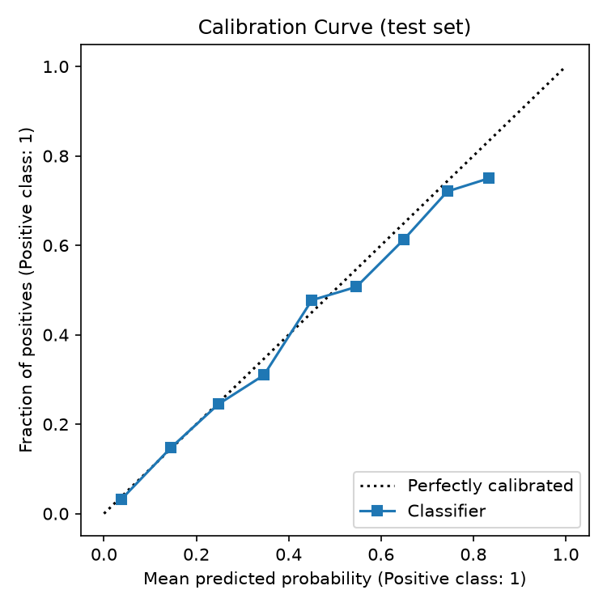

**Software Development Oriented to Machine Learning — Practice 1**
Authors: Alberto Bellera, Ignacio Garatea, Pablo Labat

## 1. Summary

We trained a small multilayer perceptron (2 hidden layers, 32 and 16
units, ~1.5K parameters) with PyTorch Lightning to predict customer
churn on the Telco Customer Churn dataset (7,043 customers, 26.5%
churn rate). Features were one-hot encoded / standardized and split
70/15/15 (train/val/test), stratified by target. The model trained
for 15 epochs on GPU in under 10 seconds.

| Split | Loss | Accuracy |
|---|---|---|
| Train | 0.406 | 81.2% |
| Validation | 0.435 | 80.0% |
| **Test** | — | **79.2%** |

The close agreement between train, validation and test metrics
indicates the model is not overfitting, and it clearly outperforms
the naive baseline of always predicting "no churn" (73.5% accuracy).

## 2. Training curves

{width=95%}

Both loss curves drop sharply in the first 1-2 epochs and then
plateau, with training loss continuing a slow, steady decrease while
validation loss flattens around 0.44 — a small, expected train/val
gap that does not indicate meaningful overfitting at this point.
Validation accuracy fluctuates mildly between epochs (typical for
such a small validation set, ~1,057 samples) while staying stable
around 79-80%, confirming 15 epochs is enough for this model and
feature set to converge; further training would likely bring
diminishing returns without better/more features.

## 3. Confusion matrix

{width=48%}

On the 1,057 test customers, the model correctly identifies most
non-churners (688 of 777, 88.5% specificity) but only about half of
actual churners (149 of 280, 53.2% recall). Precision on the churn
class is 62.6%. This asymmetry is expected given the 73.5%/26.5%
class imbalance: a plain accuracy-optimizing model tends to favor the
majority class. In a real retention-campaign setting, this means the
model would miss roughly 1 in 2 customers who are about to churn —
an important limitation to state explicitly rather than hide behind
the 79.2% headline accuracy.

## 4. Calibration curve

{width=48%}

The curve tracks the diagonal closely across most of the probability
range, indicating the model's predicted probabilities are reasonably
trustworthy, not just its hard 0/1 predictions. There is a mild
overconfidence in the upper range: for customers the model scores at
~65-85% churn probability, the actual observed churn rate is a few
points lower (e.g. ~75% actual vs. ~83% predicted at the top bin).
This is a minor miscalibration, not a major one — the model would
still rank customers by risk fairly reliably.

## 5. Highest-loss samples

We inspected the 10 test customers with the highest per-sample loss
(`reports/figures/highest_loss_samples.csv`). Every one of them is a
**false negative**: an actual churner the model was highly confident
would *not* churn (predicted probability between 0.05 and 0.09).
Most of these customers share exactly the traits that, per our EDA,
most strongly predict retention — long tenure, one/two-year
contracts, and protective add-ons like `OnlineSecurity`/`TechSupport`
— yet they churned anyway. This suggests the dataset's features
capture broad population-level patterns well, but miss whatever
specific event actually triggered these particular customers to
leave (e.g. a support complaint, a competitor offer, a price change)
— information this dataset simply does not contain.

## 6. Conclusions

The model learns real, non-trivial signal (79.2% test accuracy vs.
73.5% baseline) with no evidence of overfitting, and its probability
estimates are reasonably well calibrated. Its main weakness is recall
on the minority (churn) class — expected given the imbalance, and
the natural next step for future work (e.g. class weighting, or a
different decision threshold tuned for recall) rather than a bug.
The highest-loss analysis shows the model's errors are concentrated
on genuinely hard, low-signal cases rather than on features we
mishandled — a reasonable place to stop for this first iteration, as
the assignment explicitly asks us not to chase state-of-the-art
performance.
